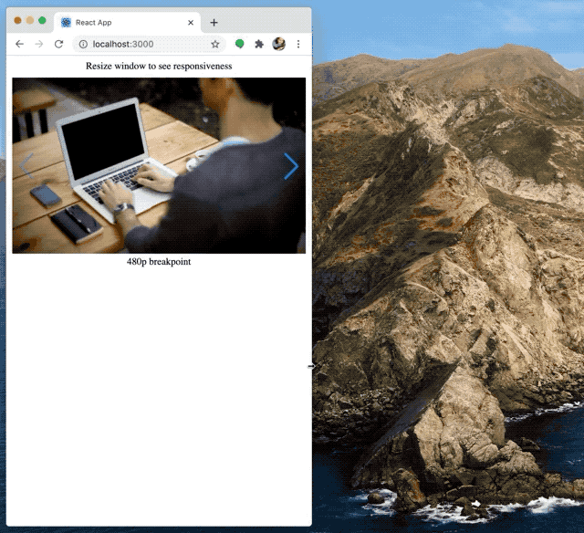

# Swiper React Responsive Demo

This demo shows how to set responsive breakpoints in [swiper-react](https://swiperjs.com/react/)



## Instructions

If you don't have yarn you have to [install it first](https://classic.yarnpkg.com/en/docs/install/#mac-stable):
```
$ brew install yarn
```

Then run:
```
$ yarn
$ yarn start
```

## Code explanation

There are 2 things you have to do in order to get breakpoints in your project working:

### 1. Add breakpoints to swiper element:

```
<Swiper
  breakpoints={{
    // when window width is >= 640px
    640: {
      width: 640,
      slidesPerView: 1,
    },
    // when window width is >= 768px
    768: {
      width: 768,
      slidesPerView: 2,
    },
  }}
>
  {slides}
</Swiper>
```

### 2. Add media queries to css

swiper-container needs the right size based on breakpoints

```
.swiper-container {
  width: 480px;
}

@media screen and (min-width: 640px) {
  .swiper-container {
    width: 640px;
  }
}

@media screen and (min-width: 768px) {
  .swiper-container {
    width: 768px;
  }
}
```
